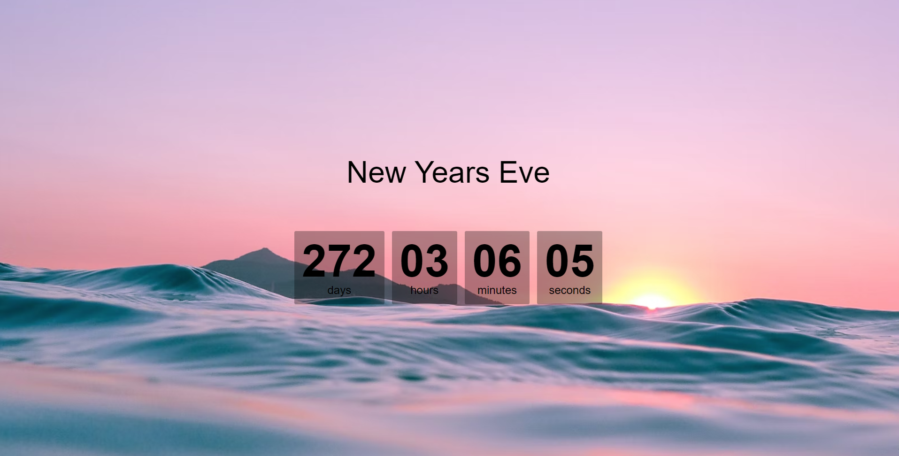

<h1 align="center">
  
</h1>
---

## 💻 Project
---
This is a simple Countdown Timer, set to January 1st of 2024 and its job is countdown till this date or to any other date you want to, because you can change the countdown date in the scripts.js file.
JavaScript daily practice


## 🧰 Technologies
---

This project was developed with the following technologies:

- HTML
- CSS
- JavaScript


### 👀 Prerequisites
---

Before starting, you will need to have the following tools installed on your machine:<br/>
[Git](https://git-scm.com) to clone this repository<br/>
A code editor like [VSCode](https://code.visualstudio.com/) and, if you are using VSCode, you can use the [Live Server](https://marketplace.visualstudio.com/items?itemName=ritwickdey.LiveServer) extension to open the project.


### 👨‍💻 Running the Project
---

```bash
# Clone this repository
$ git clone <https://github.com/Arthur-Ferreira/countdown_timer>

# Access the project folder
$ cd countdown_timer

# If you're using the Live Server extension
# Right click in the "index.html" file and click in "Open With Live Server"
```

---
<p align="center">
Made with 🖤 by ARTHUR FERREIRA
</p>